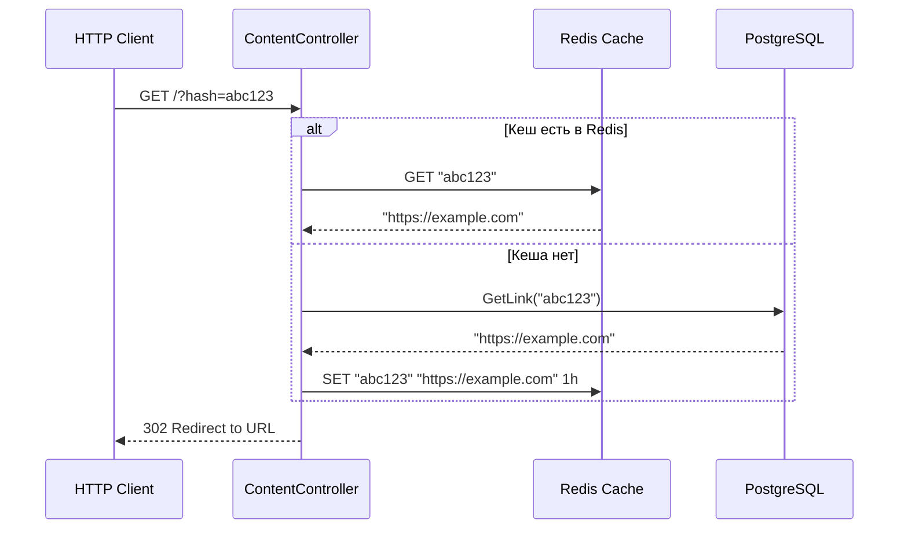

```mermaid
sequenceDiagram
    participant Client as HTTP Client
    participant Controller as ContentController
    participant Redis as Redis Cache
    participant PG as PostgreSQL

    Client->>Controller: GET /?hash=abc123
    alt Кеш есть в Redis
        Controller->>Redis: GET "abc123"
        Redis-->>Controller: "https://example.com"
    else Кеша нет
        Controller->>PG: GetLink("abc123")
        PG-->>Controller: "https://example.com"
        Controller->>Redis: SET "abc123" "https://example.com" 1h
    end
    Controller-->>Client: 302 Redirect to URL
```