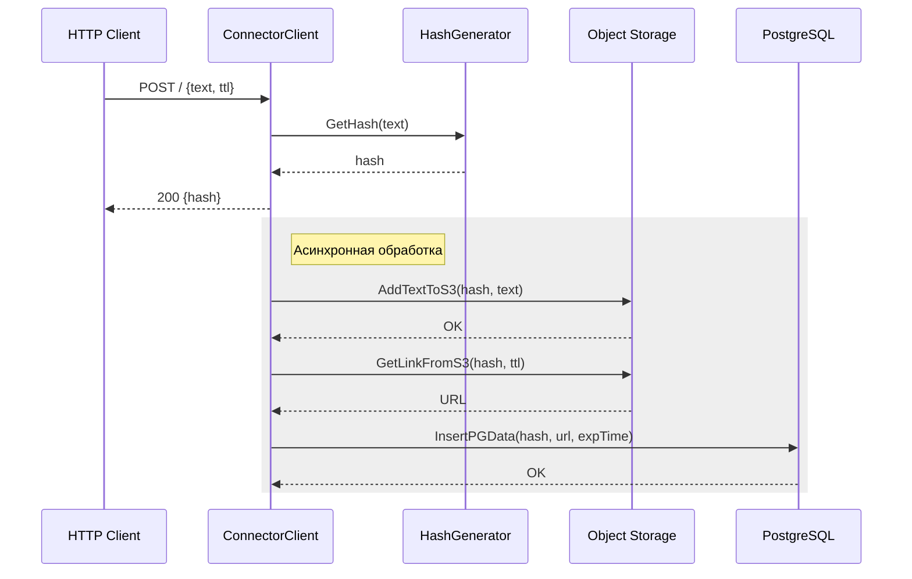

```mermaid
sequenceDiagram
    participant Client as HTTP Client
    participant Connector as ConnectorClient
    participant gRPC as HashGenerator
    participant S3 as Object Storage
    participant PG as PostgreSQL

    Client->>Connector: POST / {text, ttl}
    Connector->>gRPC: GetHash(text)
    gRPC-->>Connector: hash
    Connector-->>Client: 200 {hash}
    
    rect rgba(200,200,200,0.3)
    note right of Connector: Асинхронная обработка
    Connector->>S3: AddTextToS3(hash, text)
    S3-->>Connector: OK
    Connector->>S3: GetLinkFromS3(hash, ttl)
    S3-->>Connector: URL
    Connector->>PG: InsertPGData(hash, url, expTime)
    PG-->>Connector: OK
    end
```