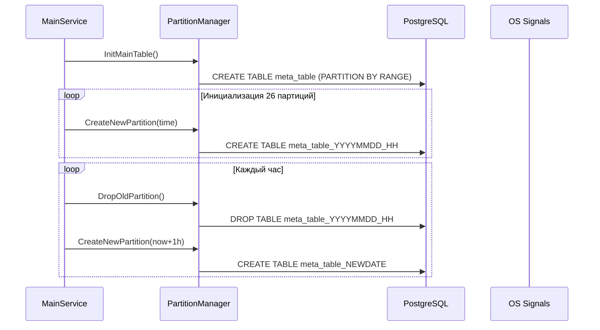

```mermaid
sequenceDiagram
    participant Main as MainService
    participant PM as PartitionManager
    participant DB as PostgreSQL
    participant OS as OS Signals

    Main->>PM: InitMainTable()
    PM->>DB: CREATE TABLE meta_table (PARTITION BY RANGE)
    
    loop Инициализация 26 партиций
        Main->>PM: CreateNewPartition(time)
        PM->>DB: CREATE TABLE meta_table_YYYYMMDD_HH
    end

    loop Каждый час
        Main->>PM: DropOldPartition()
        PM->>DB: DROP TABLE meta_table_YYYYMMDD_HH
        Main->>PM: CreateNewPartition(now+1h)
        PM->>DB: CREATE TABLE meta_table_NEWDATE
    end
```
